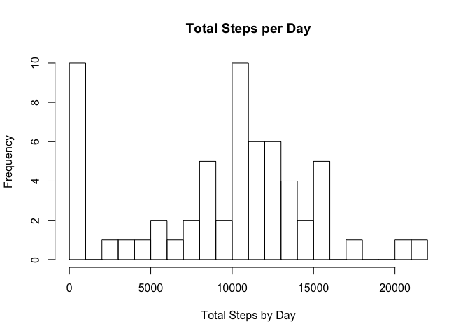
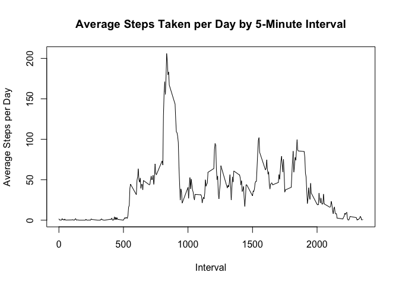
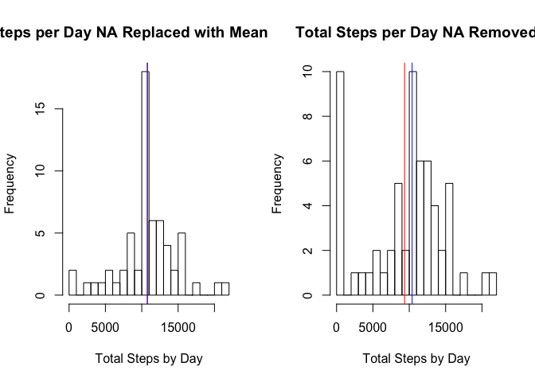
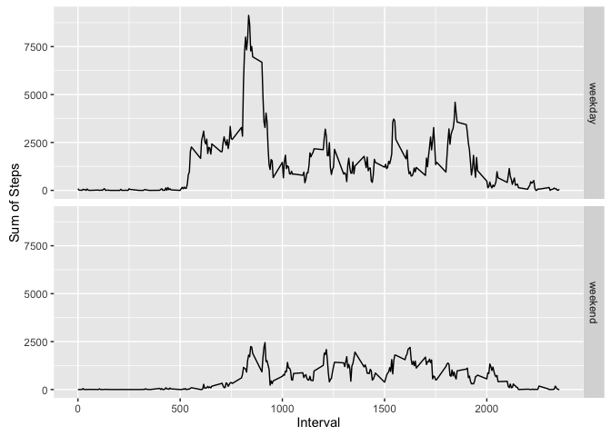

# Reproducible Research: Peer Assessment 1
Liam Hanham  
2016-04-10  

## Loading and preprocessing the data
Read in the activity data set

```r
activity <- read.csv("activity.csv")
glimpse(activity)
```

```
## Observations: 17,568
## Variables: 3
## $ steps    (int) NA, NA, NA, NA, NA, NA, NA, NA, NA, NA, NA, NA, NA, N...
## $ date     (fctr) 2012-10-01, 2012-10-01, 2012-10-01, 2012-10-01, 2012...
## $ interval (int) 0, 5, 10, 15, 20, 25, 30, 35, 40, 45, 50, 55, 100, 10...
```
Since the 'date' variable was read in as a factor variable
we need to convert it to a date variable for our analysis

```r
activity$date <- as.Date(as.character(activity$date, "%Y-%m-%d"))
```

## What is mean total number of steps taken per day?
1. Calculate the total number of steps taken per day.

We store the total steps per day in a variable 'totalStepsByDay'.
We can see the results of this calculation below.

```r
totalStepsByDay <-
     activity %>% 
     group_by(date) %>% 
     summarise(sumStepsByDay = sum(steps, na.rm = TRUE)) 
head(totalStepsByDay)
```

```
## Source: local data frame [6 x 2]
## 
##         date sumStepsByDay
##       (date)         (int)
## 1 2012-10-01             0
## 2 2012-10-02           126
## 3 2012-10-03         11352
## 4 2012-10-04         12116
## 5 2012-10-05         13294
## 6 2012-10-06         15420
```

2. Make a historgram of the total steps by day

```r
hist(totalStepsByDay$sumStepsByDay,
     breaks = 20,
     main = "Total Steps per Day",
     xlab = "Total Steps by Day")
```



3. Calculate and report the mean and median steps taken per day

```r
mean(totalStepsByDay$sumStepsByDay)
```

```
## [1] 9354.23
```

```r
median(totalStepsByDay$sumStepsByDay)
```

```
## [1] 10395
```

### The mean total steps taken per day is 9354.23

## What is the average daily activity pattern?
1. Make a time series plot (ie type = "l") of the 5 minute interval
(x-axis) and the average number of steps taken, averaged across
all days (y-axis).

First we calculate mean for each unique interval and then we can plot it.

```r
meanByInterval <-
     activity %>% 
     group_by(interval) %>% 
     summarise(meanByInterval = mean(steps, na.rm = TRUE))
plot(meanByInterval$interval, 
     meanByInterval$meanByInterval,
     type = "l",
     xlab = "Interval",
     ylab = "Average Steps per Day",
     main = "Average Steps Taken per Day by 5-Minute Interval")
```



2. Which 5 minute interval, on average across all days
in the dataset, contains the maximum number of steps?

We see a spike between interval 5000 and 1000 the code below
shows that interval is 835.

```r
intervalWithMaxAvgSteps <-
     meanByInterval %>% 
     filter(meanByInterval == max(meanByInterval$meanByInterval)) %>% 
     select(interval)
intervalWithMaxAvgSteps
```

```
## Source: local data frame [1 x 1]
## 
##   interval
##      (int)
## 1      835
```

## Imputing missing values
1. Calculate and report the total number of missing values 
in the dataset (i.e. the total number of rows with NAs).

We assume that if any of the columns in the 'activity' dataset
are NA then we have an NA row. The code below shows there are 
2304 rows with NA and all of those rows are where the 'steps'
column is NA.

```r
naRowCount <-
     activity %>% 
     filter(is.na(steps) | is.na(date) | is.na(interval)) %>% 
     summarise(rowCount = n())
naRowCount
```

```
##   rowCount
## 1     2304
```

```r
activity %>% 
     filter(is.na(steps)) %>% 
     summarise(rowCount = n())
```

```
##   rowCount
## 1     2304
```

2. Devise a strategy for filling in all of the missing values 
in the dataset. The strategy does not need to be sophisticated. 
For example, you could use the mean/median for that day, or 
the mean for that 5-minute interval, etc.

In order to use one of the suggested methods above we must explore
using the mean or medians for each day or interval. The code below
shows there are days where we have no values at all. For this reason
we can't use the average for a day to fill in missing values. For every
interval we can create a mean, so this is our best easy option at this
point.

```r
naDays <-
     totalStepsByDay %>% 
     filter(is.na(sumStepsByDay)) %>% 
     summarise(naDays = n())
# There are 8 days where we have no data.

naIntervals <-
     meanByInterval %>% 
     filter(is.na(meanByInterval)) %>%
     summarise(naIntervals = n())
# There are no intervals that are totally blank
```

3. Create a new dataset that is equal to the original dataset 
but with the missing data filled in.

```r
# new dataset the same as the original
activityNew <- activity
# selecting all of the intervals that are going to need
# mean filled in for a missing value
naStepIntervals <-
     activityNew %>% 
     filter(is.na(steps)) %>% 
     select(interval) %>% 
     distinct()
# using the 'meanByInterval' variable we created earlier
# we can join the variable we created above. We now have
# each interval that has a missing value and what value we
# want to fill into that missing data point.
naInveralsToFill <-
     naStepIntervals %>% 
     inner_join(meanByInterval,
                by = "interval")
# for each interval we can loop through the new dataset we
# created and replace the missing value with the mean of 
# the interval at that position.
for(i in 1:length(naInveralsToFill$interval)){
     activityNew[is.na(activityNew$steps) 
                 & activityNew$interval == naInveralsToFill[i, ]$interval, 
                 ]$steps <-
          naInveralsToFill[i, ]$meanByInterval
}
```

4. Make a histogram of the total number of steps taken each 
day and Calculate and report the mean and median total 
number of steps taken per day. Do these values differ from the 
estimates from the first part of the assignment? What is the 
impact of imputing missing data on the estimates of the total 
daily number of steps?


```r
totalStepsByDayNew <-
     activityNew %>% 
     group_by(date) %>% 
     summarise(sumStepsByDay = sum(steps, na.rm = TRUE)) 
# we see the mean and median of the new dataset both increase
# and the mean becomes equal to the median.
mean(totalStepsByDayNew$sumStepsByDay)
```

```
## [1] 10766.19
```

```r
median(totalStepsByDayNew$sumStepsByDay)
```

```
## [1] 10766.19
```

```r
# plotting our new and old histograms beside each other we
# see the movement of the mean and median as well as an increase
# of the distribution at the center of the histogram (as expected)
par(mfrow = c(1, 2))
hist(totalStepsByDayNew$sumStepsByDay,
     breaks = 20,
     main = "Total Steps per Day NA Replaced with Mean by Interval",
     xlab = "Total Steps by Day")
abline(v = mean(totalStepsByDayNew$sumStepsByDay),
       col = "red")
abline(v = median(totalStepsByDayNew$sumStepsByDay),
       col = "blue")
hist(totalStepsByDay$sumStepsByDay,
     breaks = 20,
     main = "Total Steps per Day NA Removed",
     xlab = "Total Steps by Day")
abline(v = mean(totalStepsByDay$sumStepsByDay),
       col = "red")
abline(v = median(totalStepsByDay$sumStepsByDay),
       col = "blue")
```



## Are there differences in activity patterns between weekdays and weekends?

1. Create a new factor variable in the dataset with two 
levels – “weekday” and “weekend” indicating whether a given 
date is a weekday or weekend day.

(Made the assumption it was best to use the old 'activity' 
dataset since our imputing of the NAs did not produce a 
very good result. If values aren't known we shouldn't guess
at what they are.)

```r
# Create a vector containing all weekend names
weekendNames <- c("Saturday", "Sunday")
# create a new colunm that contains the name of the
# day of the week. This will serve as a place holder
# for our new variable.
activity$dayOfWeek <- weekdays(activity$date)
# we then use our vector with weekend names to change 
# the names of weekend days to the name 'weekend'.
activity[activity$dayOfWeek %in% weekendNames, ]$dayOfWeek <- 
     rep("weekend",
         length(activity[activity$dayOfWeek %in% weekendNames,]$dayOfWeek))
# we can then say that every other day must be a weekday
activity[activity$dayOfWeek != "weekend", ]$dayOfWeek <- 
     rep("weekday",
         length(activity[activity$dayOfWeek != "weekend", ]$dayOfWeek))
# change the variable to factor.
activity$dayOfWeek <- as.factor(activity$dayOfWeek)
```

2. Make a panel plot containing a time series plot (ie type = "l")
of the 5-minute interval (x-axis) and the average number of steps 
taken, averaged across all weekday days or weekend days (y-axis). 
See the README file in the GitHub repository to see an example of 
what this plot should look like using simulated data.

Simply doing a sum and grouping by 'interval' and 'dayOfWeek'
will get us the answer we're looking for.

```r
totalStepsByDay <-
     activity %>% 
     group_by(interval,
              dayOfWeek) %>% 
     summarise(sumStepsByDay = sum(steps, na.rm = TRUE))
ggplot(totalStepsByDay, aes(interval, sumStepsByDay)) +
     geom_line() +
     facet_grid(dayOfWeek ~.) +
     xlab("Interval") +
     ylab("Sum of Steps")
```


